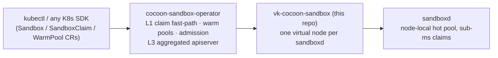

# vk-cocoon-sandbox

A [virtual-kubelet](https://github.com/virtual-kubelet/virtual-kubelet) that
serves Kubernetes **agent-sandbox semantics** (`agents.x-k8s.io`, driven by
[cocoon-sandbox-operator](https://github.com/cocoonstack/cocoon-sandbox-operator))
from [**sandboxd**](https://github.com/cocoonstack/sandbox) — the node-local
hot-sandbox daemon that hands over an already-running microVM in **0.2–0.7 ms**.

Together the three repos are the million-scale design from the operator
README's *"Scaling design"* chapter — Kubernetes stays the record-of-intent and
policy plane, the claim transaction runs on the node:



One virtual node fronts one sandboxd. A sandbox Pod scheduled here becomes a
warm claim; the Pod's IP is the sandbox VM's address; deleting the owner
`Sandbox` CR — and only that — destroys the VM.

## The contracts this provider keeps

These are the load-bearing rules, carried over from the production vk-cocoon
provider and pinned by intent tests:

1. **Pod deletion is not VM authority.** Node-NotReady taint evictions delete
   every pod on a node while the VMs keep serving users. `DeletePod` releases
   the sandbox only when the owning `Sandbox` CR is **confirmed gone** (a
   structured NotFound naming it in `Details.Name`) or **in teardown**
   (deletionTimestamp set). Everything else preserves the claim, and a
   same-name replacement pod **adopts it in place** — no second claim, same VM.
2. **No naive kind pluralization.** The owner GVR is derived with the es/ies
   rules (`Sandbox`→`sandboxes`); an endpoint-level 404 *without*
   `Details.Name` is treated as "GVR guess wrong", never as "owner deleted".
   (A naive `+"s"` once destroyed a live-owner VM.)
3. **Audit-only orphan GC.** Background reconciliation can't prove user
   intent, so the orphan scan only reports; it never releases. A failed
   sandboxd list is **not** an empty list — the cycle is skipped.
4. **Stale-UID guard.** Lifecycle requests carrying a previous pod
   generation's UID are ignored.
5. **L0 API hygiene.** Status reads are served from the provider's own table;
   no control-loop LIST hits the apiserver.
6. **Release credentials survive restarts.** The claim table (sandbox id +
   release token) persists to a 0600 state file; a provider restart keeps the
   authority to tear down exactly what it delivered.

## Pod contract

The operator routes a sandbox pod here with annotations (template/net/size
keys are shared with the operator's `pkg/scale` L2 gateway):

| Annotation | Meaning |
|---|---|
| `sandbox.cocoonstack.io/runtime: sandboxd` | route to this provider |
| `sandbox.cocoonstack.io/template` | sandboxd template axis (required) |
| `sandbox.cocoonstack.io/net`, `.../size` | claim axes (sandboxd defaults) |
| `sandbox.cocoonstack.io/ttl-seconds` | claim lease (0 = server default) |
| `sandbox.cocoonstack.io/claim-id` | **written back**: the backing claim id |

No warm capacity (sandboxd 429/redirect) fails the create typed — the pod
stays Pending and the operator's L1 path handles fallback.

## L3 inventory

With `--publish-inventory` the node server-side-applies one O(nodes)
`NodeInventory` summary (via the operator's `pkg/scale` publisher) so the
aggregated apiserver can serve `kubectl get sandboxes` with **zero**
per-sandbox etcd objects.

## Run

```bash
vk-cocoon-sandbox \
  --node-name vk-sandboxd-node1 \
  --sandboxd-url http://127.0.0.1:7777 \
  --sandboxd-token-file /etc/sandboxd/api-token \
  --state-path /var/lib/vk-cocoon-sandbox/claims.json \
  --publish-inventory
```

`KUBECONFIG` (or in-cluster config) must reach the cluster; see
[manifests/](manifests/) for a systemd/DaemonSet-style deployment and the RBAC
the destroy-authorization read needs (get on `sandboxes.agents.x-k8s.io`).

The kubelet exec/logs/port-forward surfaces are intentionally not served —
interactive access goes through the sandbox SDK and preview URLs.

## Develop

```bash
make all        # fmt-check vet test build
make race lint
```

## Community

- Contributions: [CONTRIBUTING.md](CONTRIBUTING.md)
- Governance: [GOVERNANCE.md](GOVERNANCE.md) · [MAINTAINERS.md](MAINTAINERS.md)
- Security reports: [SECURITY.md](SECURITY.md)
- Direction: [ROADMAP.md](ROADMAP.md)
- Code of conduct: [CODE_OF_CONDUCT.md](CODE_OF_CONDUCT.md)

## License

Apache 2.0 — see [LICENSE](LICENSE).
