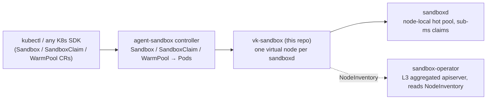

# vk-sandbox

A [virtual-kubelet](https://github.com/virtual-kubelet/virtual-kubelet) that
serves Kubernetes **agent-sandbox semantics** (`agents.x-k8s.io`, driven by
[kubernetes-sigs/agent-sandbox](https://github.com/kubernetes-sigs/agent-sandbox))
from [**sandboxd**](https://github.com/cocoonstack/sandbox) — the node-local
hot-sandbox daemon that hands over an already-running microVM in **0.2–0.7 ms**.

**Documentation: [cocoonstack.github.io/vk-sandbox](https://cocoonstack.github.io/vk-sandbox/)**
(source in [`docs/`](docs/)).

## Architecture

Kubernetes stays the record-of-intent and policy plane; the claim transaction
runs on the node:



One virtual node fronts one sandboxd. A sandbox Pod whose template carries the
[Pod contract](docs/pod-contract.md) schedules here and becomes a warm claim;
the Pod's IP is the host part of sandboxd's `owner_addr`. The VM is released
when its owner is deleted, expires, enters teardown, or is replaced, or when a
bare Pod (no controller owner) is deleted.

The seven load-bearing rules this provider keeps — delete authorization, GVR
derivation, audit-only orphan GC, the stale-UID guard, L0 API hygiene,
published lease expiry, durable release credentials — are listed in
[Architecture](docs/architecture.md#the-contracts-this-provider-keeps); the
Pod annotation contract is in [Pod contract](docs/pod-contract.md) and every
flag in [Configuration](docs/configuration.md).

## Quick start

```bash
vk-sandbox \
  --node-name vk-sandboxd-node1 \
  --sandboxd-url http://127.0.0.1:7777 \
  --sandboxd-advertise-addr "<node-address>:7777" \
  --sandboxd-token-file /etc/sandboxd/api-token \
  --state-path /var/lib/vk-sandbox/claims.json \
  --publish-inventory
```

`KUBECONFIG` (or in-cluster config) must reach the cluster; see
[manifests/](manifests/) for the RBAC
the destroy-authorization read needs (get on `sandboxes.agents.x-k8s.io`).
Replace `<node-address>` with the address the operator can reach; the local
claim URL can remain on loopback.

The kubelet exec/logs/port-forward surfaces are intentionally not served —
interactive access goes through the sandbox SDK and preview URLs.

## Related projects

- [agent-sandbox](https://github.com/kubernetes-sigs/agent-sandbox) — the
  `agents.x-k8s.io` CRDs and the controller that turns a Sandbox into the Pod
  this provider serves
- [sandbox-operator](https://github.com/cocoonstack/sandbox-operator) — the
  L3 aggregated apiserver that reads this provider's `NodeInventory`, and the
  `pkg/sandboxd` client, `pkg/scale` keys and `pkg/logbridge` log sink this
  repo imports
- [sandbox](https://github.com/cocoonstack/sandbox) — sandboxd, the node-local
  hot pool this provider claims from, plus silkd and the SDKs
- [vk-cocoon](https://github.com/cocoonstack/vk-cocoon) — the sibling provider
  that runs full Cocoon microVM pods
- [cocoon](https://github.com/cocoonstack/cocoon) — the microVM engine underneath

## Development

```bash
make build
make test
make lint
make fmt
```

## License

AGPL-3.0 — see [LICENSE](LICENSE).
