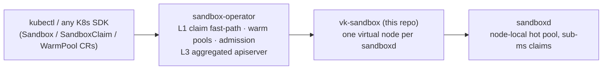

# vk-sandbox

A [virtual-kubelet](https://github.com/virtual-kubelet/virtual-kubelet) that
serves Kubernetes **agent-sandbox semantics** (`agents.x-k8s.io`, driven by
[sandbox-operator](https://github.com/cocoonstack/sandbox-operator)) from
[**sandboxd**](https://github.com/cocoonstack/sandbox) — the node-local
hot-sandbox daemon that hands over an already-running microVM in **0.2–0.7 ms**.

**Documentation: [cocoonstack.github.io/vk-sandbox](https://cocoonstack.github.io/vk-sandbox/)**
(source in [`docs/`](docs/)).

## Architecture

Kubernetes stays the record-of-intent and policy plane; the claim transaction
runs on the node:



One virtual node fronts one sandboxd. A sandbox Pod scheduled here becomes a
warm claim; the Pod's IP is the host part of sandboxd's `owner_addr`. The VM
is released when its owner is deleted, expires, enters teardown, or is
replaced, or when a bare Pod (no controller owner) is deleted.

## Quick start

```bash
vk-sandbox \
  --node-name vk-sandboxd-node1 \
  --sandboxd-url http://127.0.0.1:7777 \
  --sandboxd-advertise-addr "<node-address>:7777" \
  --sandboxd-token-file /etc/sandboxd/api-token \
  --state-path /var/lib/vk-sandbox/claims.json \
  --publish-inventory
```

`KUBECONFIG` (or in-cluster config) must reach the cluster; see
[manifests/](manifests/) for the RBAC
the destroy-authorization read needs (get on `sandboxes.agents.x-k8s.io`).
Replace `<node-address>` with the address the operator can reach; the local
claim URL can remain on loopback.

The kubelet exec/logs/port-forward surfaces are intentionally not served —
interactive access goes through the sandbox SDK and preview URLs.

## The contracts this provider keeps

The load-bearing rules, carried over from the production vk-cocoon provider and
pinned by intent tests:

1. **Pod deletion is not VM authority.** Node-NotReady taint evictions delete
   every pod on a node while the VMs keep serving users. For a controller-owned
   Pod, `DeletePod` releases only when the owning `Sandbox` is **confirmed gone** (a
   structured NotFound naming it in `Details.Name`), replaced by another UID,
   **in teardown** (deletionTimestamp set), or **expired** (Ready reason
   `SandboxExpired`). Otherwise the claim is preserved, and a
   same-name replacement pod **adopts it in place** — no second claim, same VM.
2. **No naive kind pluralization.** The owner GVR is derived with the es/ies
   rules (`Sandbox`→`sandboxes`); an endpoint-level 404 *without*
   `Details.Name` is treated as "GVR guess wrong", never as "owner deleted".
   (A naive `+"s"` once destroyed a live-owner VM.)
3. **Audit-only orphan GC.** Background reconciliation can't prove user
   intent, so the orphan scan only reports; it never releases. A failed
   sandboxd list is **not** an empty list — the cycle is skipped.
4. **Stale-UID guard.** Lifecycle requests carrying a previous pod
   generation's UID are ignored.
5. **L0 API hygiene.** Status reads are served from the provider's own table;
   no control-loop LIST hits the apiserver.
6. **Lease expiry is published, never discovered.** The node grants a lease at
   claim time and its archive lifecycle may rewrite it. After the cached
   deadline, the watcher refreshes a still-listed claim or publishes `Failed`
   on confirmed absence; listing errors defer the decision. virtual-kubelet
   never polls an asynchronous provider.
7. **Release credentials survive restarts.** The claim table (sandbox id +
   release token) persists to a 0600 state file; a provider restart keeps the
   authority to tear down exactly what it delivered.

The Pod annotation contract and the claim axes are documented in
[Pod contract](docs/pod-contract.md), the `--publish-inventory` L3 summary in
[Architecture](docs/architecture.md), and every flag in
[Configuration](docs/configuration.md).

## Related projects

- [sandbox-operator](https://github.com/cocoonstack/sandbox-operator) — the
  Kubernetes control plane that routes sandbox Pods to this provider
- [sandbox](https://github.com/cocoonstack/sandbox) — sandboxd, the node-local
  hot pool this provider claims from, plus silkd and the SDKs
- [vk-cocoon](https://github.com/cocoonstack/vk-cocoon) — the sibling provider
  that runs full Cocoon microVM pods
- [cocoon](https://github.com/cocoonstack/cocoon) — the microVM engine underneath

## Development

```bash
make build
make test
make lint
make fmt
```

## Community

- Contributions: [CONTRIBUTING.md](CONTRIBUTING.md)
- Governance: [GOVERNANCE.md](GOVERNANCE.md) · [MAINTAINERS.md](MAINTAINERS.md)
- Security reports: [SECURITY.md](SECURITY.md)
- Direction: [ROADMAP.md](ROADMAP.md)
- Code of conduct: [CODE_OF_CONDUCT.md](CODE_OF_CONDUCT.md)

## License

AGPL-3.0 — see [LICENSE](LICENSE).
